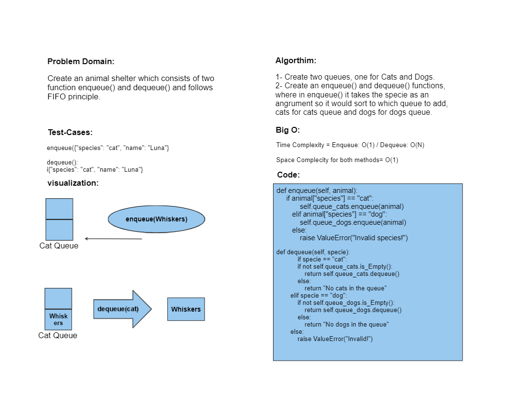

# Challenge Title: Stacks & Queues
This is an implementation of using Stack & Queues in python.
## Whiteboard Process

**Stack & Queues**

**PseudoQueue**

**Animal Shelter**

## Approach & Efficiency
O(N), as some function needs to go throught an iterations.

## Solution
Simply pytest to test the program, or run it to show the printed linkedlist.