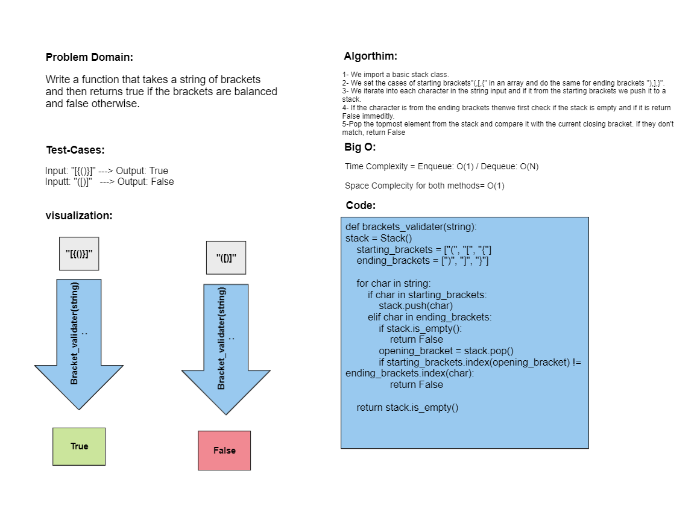

# Challenge Title: Multi-bracket Validation.
This is an implementation of using a function to validate string of brackets and return "True" if it balanced and "False" if not.
## Whiteboard Process

## Approach & Efficiency
O(N) Time complexity and O(1) for space complexity.

## Solution
Simply pytest to test the program.