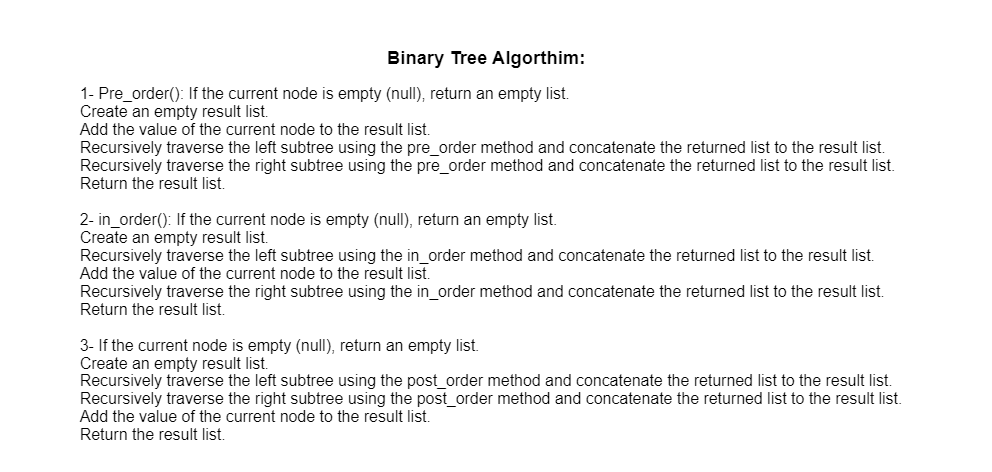

# Challenge Title: Binary Tree and BST
1- Create a Binary Tree class with the following methods: pre_order(), in_order() and post_order()

2- Create a Binary Search Tree class with following methods: Add() & Contains().
## Whiteboard Process

## Binary Tree algorithm:

## Binary Search Tree algorithm:

## Approach & Efficiency

O(N) Time complexity and O(1) for space complexity.

## Solution
Simply pytest to test the program.