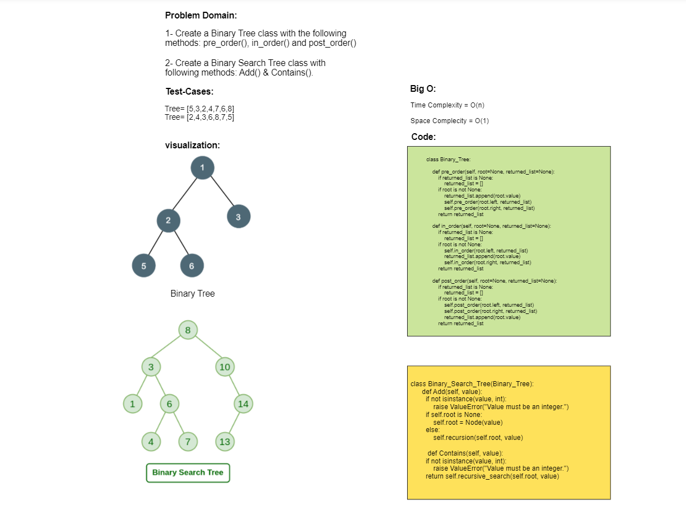

# Challenge Title: Binary Tree and BST
1- Create a Binary Tree class with the following methods: pre_order(), in_order() and post_order()

2- Create a Binary Search Tree class with following methods: Add() & Contains().

3- Find the Maximum Value in a Binary Tree
## Whiteboard Process



## Binary Tree algorithm:


## Binary Search Tree algorithm:


## Approach & Efficiency
***Binary Tree Class:***

1- pre_order():
```
Time complexity: O(n) 
Space complexity: O(n)
```
2- in_order():
```
Time complexity: O(n) 
Space complexity: O(n)
```
3- post_order():
```
Time complexity: O(n) 
Space complexity: O(n)
```
4- find_maximum_value():
```
Time complexity: O(n) 
Space complexity: O(1)
```
5- recursive_maximum_value():
```
Time complexity: O(n) 
Space complexity: O(n)
```

***Binary Search Tree Class:***

1- Add():
```
Time complexity: O(n) 
Space complexity: O(n)
```
2- recursion():
```
Time complexity: O(n) 
Space complexity: O(n)
```
3- Contains():
```
Time complexity: O(n) 
Space complexity: O(n)
```
4- recursive_search():
```
Time complexity: O(n) 
Space complexity: O(n)
```
## Solution
Simply pytest to test the program.