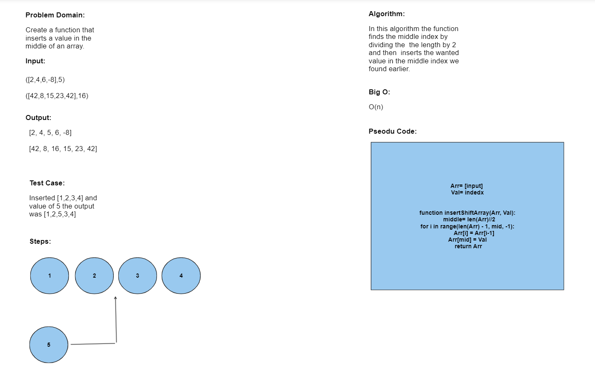

# Code Challenge: Class 02
Insert a value into the middle of an array.

## Whiteboard Process

## Approach & Efficiency
In this solution I've used only the insert property to add on an array in a specific position.
The Big O in this approach was O(N).

## Solution
You can simply run this code by calling the function insertShiftArray() and passing the array and the wanted value.