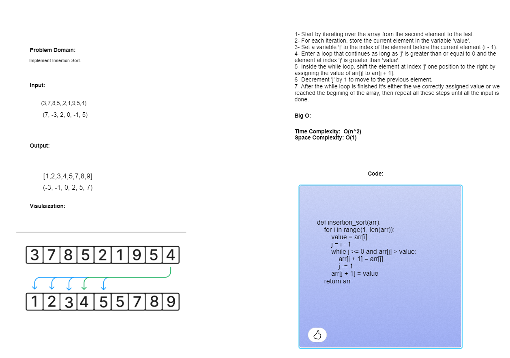

# Code Challenge: Class 29
Implement the insertion sort.
## Whiteboard Process

## Approach & Efficiency
Time Complexity: O(n^2)
Space Complexity: O(1)
## Interview Document
[Here!](https://docs.google.com/spreadsheets/d/1IDrEUmqOh4hw9CkUrkopYK8Njqu7kXpbR6gfqjCd054/edit?usp=sharing)