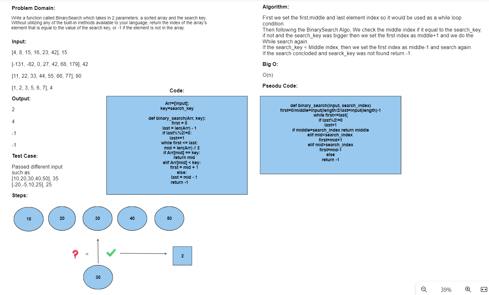

# Code Challenge: Class 03
Write a function called BinarySearch which takes in 2 parameters: a sorted array and the search key. Without utilizing any of the built-in methods available to your language, return the index of the array’s element that is equal to the search key, or -1 if the element does not exist.
## Whiteboard Process

## Approach & Efficiency
Big O= O(N), kept using while to keep changing the middle index and compare upon it to check if it the search_index is equal to it or not.

## Solution
use the code and input the specfifced array you wish to search on and add the search_key you want to search inside the given array.