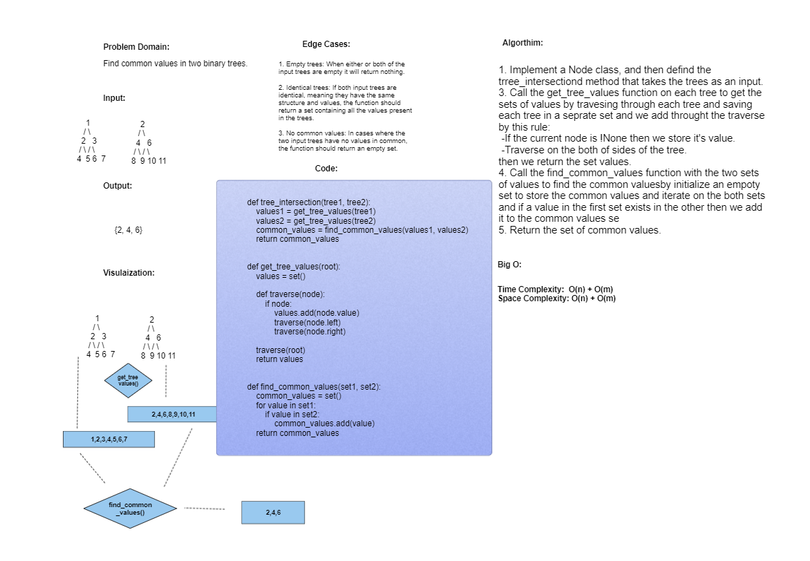

# Challenge: Hash Table Repeated Word
Find common values in 2 binary trees.
---

---
## Whiteboard Process:

---
## Approach & Efficiency

- Time Complexity: O(n) + O(m)
- Space Compleity: O(n) + O(m)

---
## Solution
[Here!](./tree_intersection.py)
---
---