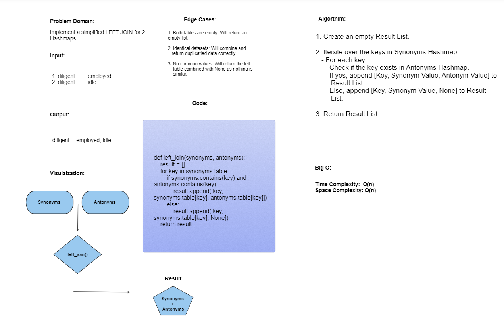

# Challenge: Hash Table's Left Join
Implement a simplified LEFT JOIN for 2 Hashmaps.
---

## Whiteboard Process:

---
## Approach & Efficiency

- Time Complexity: O(n) 
- Space Compleity: O(n) 

---
## Solution
[Here!](./left_join.py)
---
---