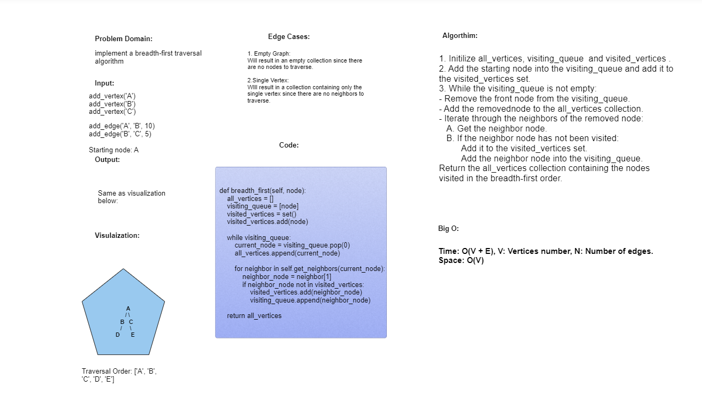
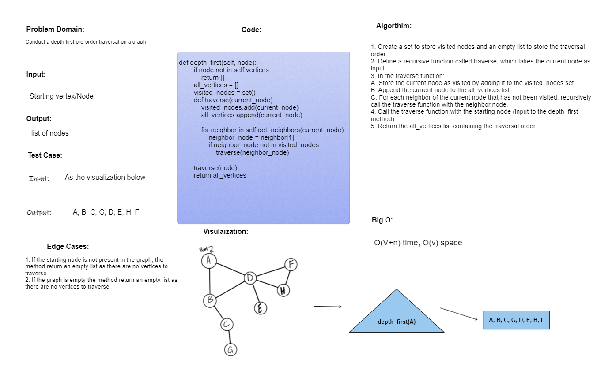

# Challenge Class 35 - 38: Graph Implementation
CC35: Implement your own Graph. The graph should be represented as an adjacency list.

CC36: Implement a BFT Algorthm.

CC37: Given a business trip itinerary, and an Alaska Airlines route map, is the trip possible with direct flights? If so, how much will the total trip cost be?

CC38: Conduct a depth first pre-order traversal on a graph

---


## Whiteboard Process:
Graph:


BFT:



Business Trip:


DFS:



---
## Approach & Efficiency

1. add_vertex():
```
 O(1) time, O(1) space
```

2. add_edge():
```
 O(1) time, O(1) space
```
3. get_vertices(): 
```
O(V) time, O(V) space, where V is the number of vertices
```
4. get_neighbors(): 
```
O(1) time, O(E) space, where E is the number of edges
```
5. size():
```
 O(1) time, O(1) space
```
6. BFT():
```
 O(V+n) time, O(v) space
```
7. DFS():
```
 O(V+n) time, O(v) space
```

---
## Solution
[Here!](./graph.py)
---
