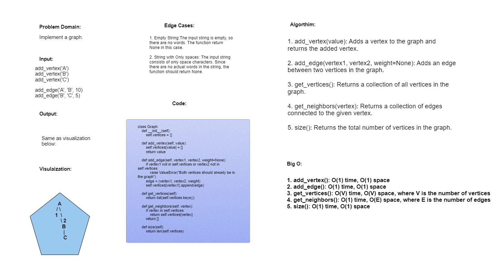

# Challenge Class 35: Graph Implementation
Implement your own Graph. The graph should be represented as an adjacency list.

---


## Whiteboard Process:

---
## Approach & Efficiency

1. add_vertex():
```
 O(1) time, O(1) space
```

2. add_edge():
```
 O(1) time, O(1) space
```
3. get_vertices(): 
```
O(V) time, O(V) space, where V is the number of vertices
```
4. get_neighbors(): 
```
O(1) time, O(E) space, where E is the number of edges
```
5. size():
```
 O(1) time, O(1) space
```

---
## Solution
[Here!](./graph.py)
---
