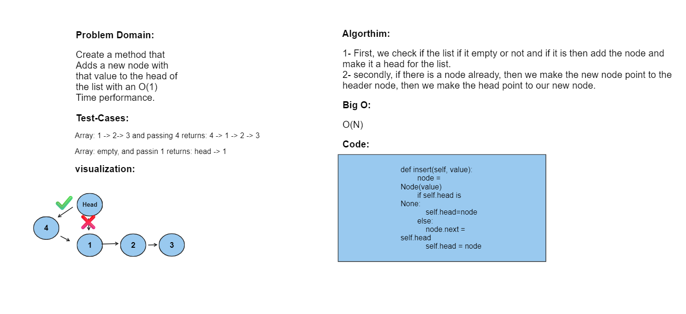
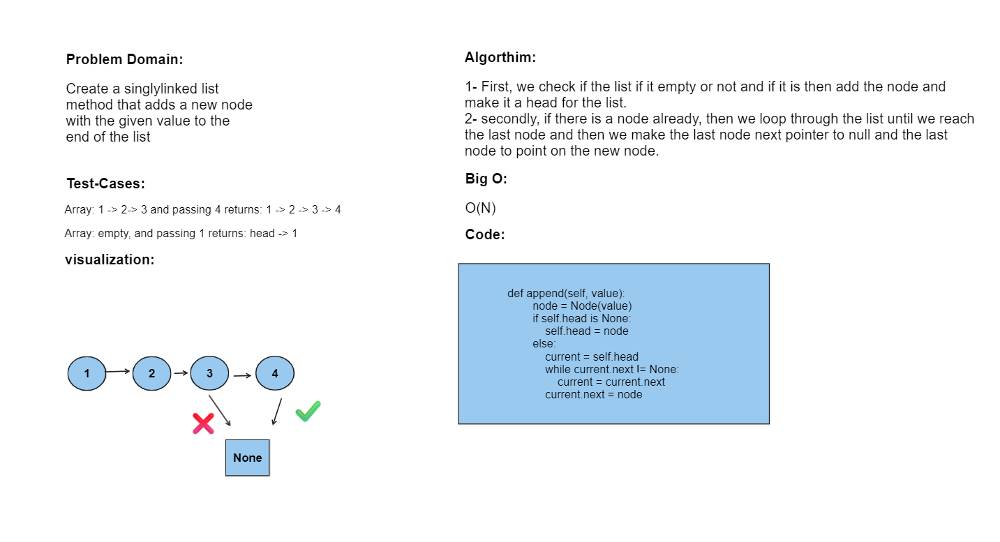
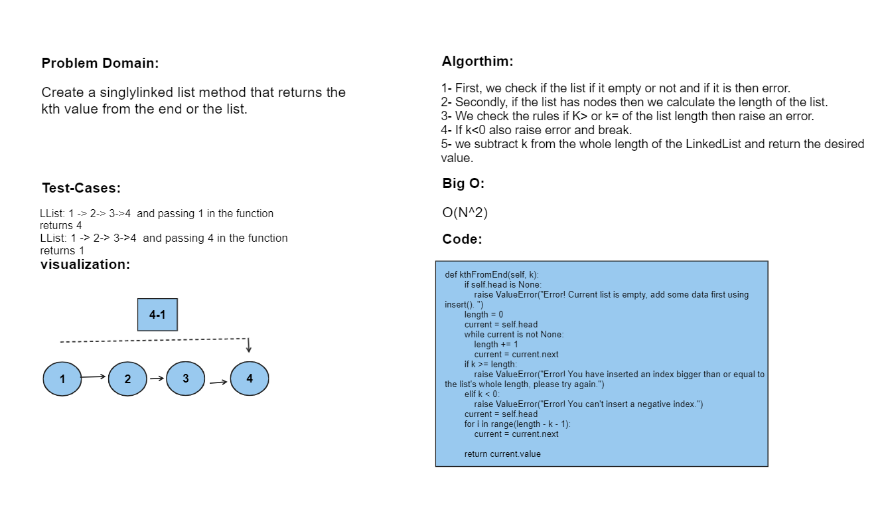

# Challenge Title: Singly LinkedList
This is an implementation of using singly linked list in python.
## Whiteboard Process

**Insert:**

**Append:**

**Insert Before:**

**Insert After:**

**kth From End:**

## Approach & Efficiency
O(N), as some function needs to go throught an iterations.

## Solution
Simply pytest to test the program, or run it to show the printed linkedlist.